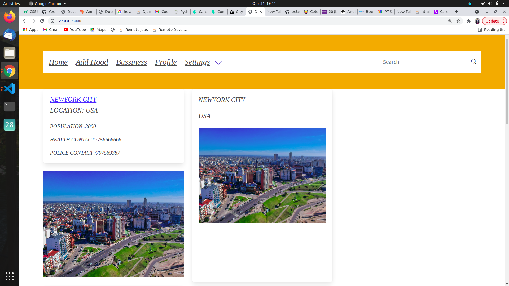
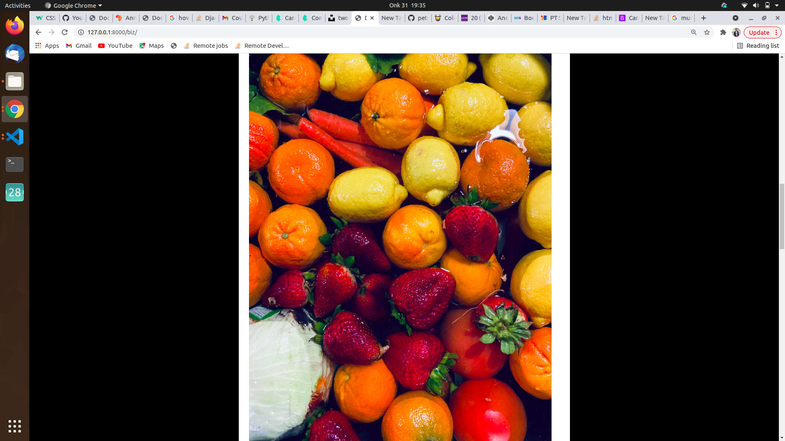

# My Mtaa

## Date, 31/10/2021

## By Peter Chege Wairimu.

# Description 

my mtaa is a web application where a user gets to explore other regions around him or in the world. A user can add a hood and bussiness in their hood also.

# Instructions

(i). Register in the sign up page inorder to have access in the the page

(ii). Login and see your profile also you can  update it if you want

(iii). Add  your neighbourhood, add bussiness around your hood.  

# Technologies Used

### (1).HTML.

### (2).Css.

### (3).Bootstrap.

### (4). Javascript.

### (5). Python/Django.

## 

# Support and contact details
Incase of any queries or any clarification you can contact me via email or phone.

### email. chegewairimu66@gmail.com

### phone. 0707569387

# License

License permission is hereby granted ,free of charge to anyone obtaining a copy of these software and associated documentation to deal in the software without restrictions including without limitation the rights to use ,copy modify ,publish and distribute copies of these software and to permit persons to whom the software is furnished to do so,subject to the following conditions:

The above copyright notice should be included.

## Copyright (c) 2021